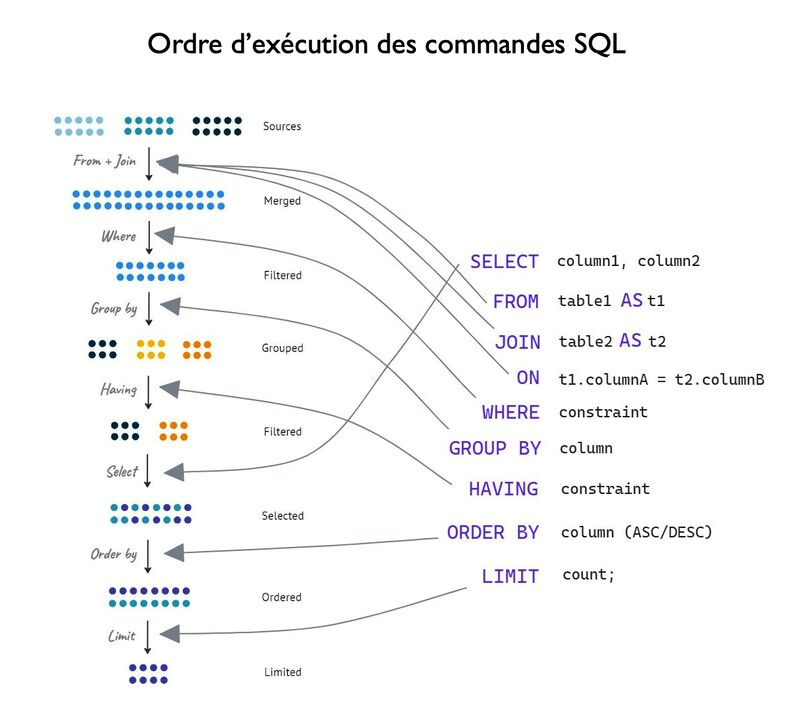

# SQL NO SQL



## Notes

- [init_db](./sql//init_db.sql) initialise les tables de la base de données ( à la mano)
- [migrate_dummy](./sql/migrate_dummy.sql) peuple la base de données ( à la mano)

## Liens

- Exercice 1 :
  - [consigne](./exercices/1/consigne.md)
  - [devoir](./exercices/1/devoir.sql)

## Repo structure

```plaintext
📁 SQL_NO_SQL
    📁 cours
        ─ pdf_conception_camping_TP.pdf
        ─ sql.jpeg
    📁 exercices
        📁 1
            ─ consigne.md
            ─ devoir.sql
        ─ 2
    📁 sql
        ─ init_db.sql
        ─ migrate_dummy.sql
    ─ .gitignore
    ─ README.md
```
